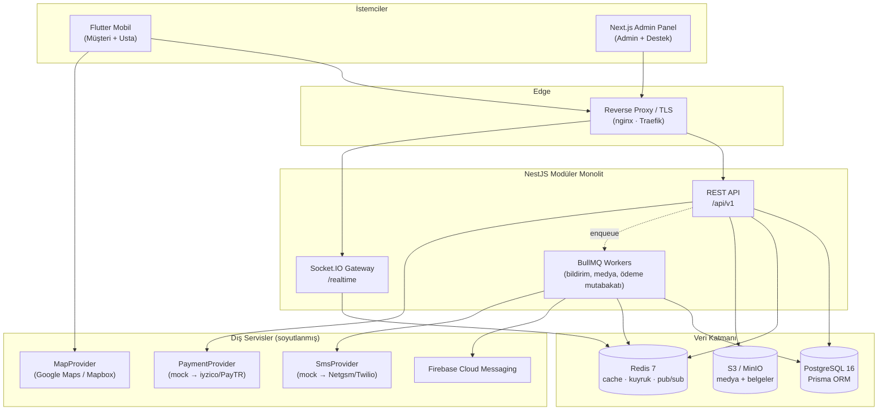

# UstaPilot — Sistem Mimarisi

> Doğru usta. Doğru fiyat. Güvenli hizmet.

## 1. Genel Bakış

UstaPilot, hizmet talebi oluşturan müşteriler ile ustaları buluşturan bir pazaryeri
platformudur. İlk pazar Gaziantep'tir; mimari baştan **çok şehirli, çok ülkeli ve çok
dilli** çalışacak şekilde kurgulanmıştır.

Sistem üç istemci ve bir modüler monolit backend'den oluşur:



### Neden modüler monolit?

MVP aşamasında mikroservis, dağıtık transaction ve operasyon maliyeti getirir. Bunun
yerine tek deploy edilebilir NestJS uygulaması içinde **sıkı modül sınırları** kuruyoruz:

- Her modül kendi `service`, `controller`, `dto`, `repository` katmanına sahip.
- Modüller arası erişim **yalnızca public service arayüzü** üzerinden yapılır; başka bir
  modülün Prisma sorgusu doğrudan çağrılmaz.
- Modüller arası gevşek bağ gereken yerlerde (bildirim, audit log, analytics) **domain
  event** yayınlanır (`EventEmitter2` → BullMQ).
- Bu sayede ileride `payments` veya `messaging` ayrı servise taşınırken sadece taşıma
  katmanı değişir, iş mantığı değişmez.

## 2. Katmanlar

### 2.1 Backend (NestJS + TypeScript strict)

```
HTTP/WS  →  Guard (JWT · Roles · Permissions)
         →  Interceptor (response envelope · logging · timeout)
         →  Pipe (class-validator DTO doğrulama)
         →  Controller (ince, iş mantığı yok)
         →  Service (iş kuralları, transaction sınırı)
         →  Repository / PrismaService
         →  PostgreSQL
```

Kesişen ilgi alanları (cross-cutting):

| İlgi alanı     | Uygulama                                                               |
| -------------- | ---------------------------------------------------------------------- |
| Kimlik         | `JwtAccessGuard` + `JwtRefreshGuard`, refresh token rotation           |
| Yetki          | `RolesGuard` (kaba) + `PolicyGuard` (nesne bazlı / ownership)          |
| Doğrulama      | Global `ValidationPipe` (whitelist, forbidNonWhitelisted, transform)   |
| Yanıt formatı  | Global `ResponseInterceptor` → `{ success, data, meta, error }`        |
| Hata           | Global `AllExceptionsFilter` → makine-okunur `code` + kullanıcı mesajı |
| Log            | `pino` (JSON, request-id korelasyonu, PII maskeleme)                   |
| Rate limit     | `@nestjs/throttler` + Redis store                                      |
| Dosya          | `FilesModule` → S3/MinIO presigned URL, MIME + magic-byte doğrulaması  |
| İzlenebilirlik | `AuditLogModule` (kim, ne, ne zaman, önce/sonra)                       |

### 2.2 Gerçek zamanlı katman

- Socket.IO, JWT ile el sıkışma (handshake) doğrulaması yapar.
- Redis adapter kullanılır → yatay ölçeklemede birden fazla API instance'ı arasında
  event dağıtımı çalışır.
- Odalar: `user:{userId}`, `conversation:{conversationId}`, `job:{jobRequestId}`.
- Kanallar: mesaj, yazıyor bilgisi, okundu bilgisi, iş durumu değişimi, yeni teklif.

### 2.3 Arka plan işleri (BullMQ)

| Kuyruk          | İş                                                                 |
| --------------- | ------------------------------------------------------------------ |
| `notifications` | Push/e-posta/SMS gönderimi, yeniden deneme                         |
| `job-matching`  | Yeni talebi uygun ustalara dağıtma (kategori + bölge)              |
| `media`         | Görsel işleme, thumbnail, EXIF temizleme                           |
| `payments`      | Provizyon yakalama, ustaya aktarım, mutabakat                      |
| `maintenance`   | Süresi dolan teklifleri kapatma, hatırlatmalar, istatistik toplama |

### 2.4 Mobil (Flutter — feature-first clean architecture)

```
presentation  →  Riverpod provider / notifier  →  UseCase (domain)
                                                →  Repository (domain arayüz)
                                                →  RepositoryImpl (data)
                                                →  RemoteDataSource (Dio) | LocalDataSource (Isar/Secure Storage)
```

- Sunum katmanı domain modelleriyle çalışır; DTO sızıntısı yoktur.
- Ağ hataları `Failure` tipine dönüştürülür; her ekran `loading / empty / error / retry`
  durumlarını ele alır.
- Token yenileme Dio interceptor'ında tek-uçuş (single-flight) mantığıyla yapılır.

### 2.5 Admin panel (Next.js App Router)

- Sunucu tarafında oturum çerezi (httpOnly) ile korunan route grupları.
- TanStack Query ile veri yönetimi, React Hook Form + Zod ile form doğrulama.
- Yetkiye göre menü ve aksiyon görünürlüğü; yetki backend'de tekrar doğrulanır.

## 3. Monorepo Klasör Yapısı

```
usta-pilot/
├─ apps/
│  ├─ backend/                 # NestJS API (modüler monolit)
│  │  ├─ prisma/
│  │  │  ├─ schema.prisma
│  │  │  ├─ migrations/
│  │  │  └─ seed/
│  │  ├─ src/
│  │  │  ├─ common/            # guard, interceptor, filter, decorator, dto
│  │  │  ├─ config/            # env şeması ve tipli config
│  │  │  ├─ infra/             # prisma, redis, storage, queue, realtime
│  │  │  ├─ modules/           # auth, users, job-requests, offers, ...
│  │  │  └─ main.ts
│  │  └─ test/
│  ├─ admin/                   # Next.js yönetim paneli
│  │  └─ src/{app,components,features,lib,hooks}
│  └─ mobile/                  # Flutter uygulaması
│     └─ lib/{app,core,features}
├─ packages/
│  ├─ shared-types/            # backend ↔ admin ortak tipler ve enum'lar
│  └─ eslint-config/           # ortak lint kuralları
├─ docs/                       # bu dokümanlar
├─ docker/                     # Dockerfile'lar ve init script'leri
├─ .github/workflows/          # CI
├─ docker-compose.yml
├─ .env.example
└─ package.json                # npm workspaces kökü
```

Flutter uygulaması `apps/mobile` altında yer alır ancak npm workspace üyesi değildir;
kendi `pubspec.yaml` bağımlılık yönetimini kullanır.

### Flutter iç yapısı

```
lib/
├─ app/                        # uygulama kökü, bootstrap, global provider'lar
├─ core/
│  ├─ api/                     # Dio istemcisi, interceptor'lar, envelope çözümleme
│  ├─ auth/                    # oturum durumu, token deposu
│  ├─ constants/
│  ├─ errors/                  # Failure, exception eşlemesi
│  ├─ extensions/
│  ├─ localization/            # ARB dosyaları, l10n üretimi
│  ├─ routing/                 # GoRouter, koruma (guard) mantığı
│  ├─ storage/                 # secure storage, Isar
│  ├─ theme/                   # renk, tipografi, boşluk, bileşen temaları
│  ├─ utils/
│  └─ widgets/                 # tasarım sistemi (AppButton, JobCard, ...)
└─ features/
   └─ <feature>/
      ├─ data/                 # dto, datasource, repository_impl
      ├─ domain/               # entity, repository arayüzü, usecase
      └─ presentation/         # ekran, widget, provider
```

## 4. Ortamlar

| Ortam         | Amaç                             | Veri                        |
| ------------- | -------------------------------- | --------------------------- |
| `development` | Yerel geliştirme, Docker Compose | Seed + demo hesapları       |
| `test`        | Otomatik testler, CI             | Her koşuda sıfırlanan şema  |
| `staging`     | Yayın öncesi doğrulama           | Anonimleştirilmiş veri      |
| `production`  | Canlı                            | Demo hesap **oluşturulmaz** |

Demo hesapları yalnızca `NODE_ENV=development` ve `SEED_DEMO_ACCOUNTS=true` iken
oluşturulur. Seed script'i production'da açıkça hata verip durur.

## 5. Çok Ülkeli / Çok Şehirli Tasarım Kararları

| Konu              | Karar                                                                                                                            |
| ----------------- | -------------------------------------------------------------------------------------------------------------------------------- |
| Konum hiyerarşisi | `Country → City → District → Neighborhood`, hepsi veritabanında; kod içinde sabit liste yok                                      |
| Para birimi       | Her parasal alan `amountMinor: BigInt` + `currency: CHAR(3)`; float kullanılmaz                                                  |
| Yerelleştirme     | Kullanıcı `locale` + `country` alanları; içerik metinleri istemci tarafında ARB, veri metinleri (kategori adı) çeviri tablosunda |
| Saat dilimi       | Sunucuda her şey UTC; gösterimde kullanıcı saat dilimi                                                                           |
| Telefon           | E.164 formatında saklanır, ülke kodu ayrı alanda                                                                                 |
| Vergi/komisyon    | `CommissionRule` ülke, şehir, kategori ve plan bazında filtrelenebilir                                                           |
| Yasal metinler    | Sürümlenmiş `LegalDocument` kaydı; ülke + dil + sürüm                                                                            |

## 6. Ölçeklenme Yolu

1. **Bugün:** tek API konteyneri, tek Postgres, tek Redis.
2. **Yük artınca:** API yatay ölçeklenir (stateless), Socket.IO Redis adapter zaten hazır;
   Postgres read-replica; medya CDN arkasına alınır.
3. **Bölgesel büyüme:** `job-matching` ve `notifications` worker'ları ayrı konteynere alınır.
4. **Servis ayrıştırma:** modül sınırları hazır olduğu için `payments` ve `messaging` ilk
   ayrılacak adaylardır.

## 7. Varsayımlar (onay bekleyen kararlar)

Aşağıdaki maddelerde makul varsayımlarla ilerlenmiştir; nihai karar sizindir:

| Konu               | Varsayım                                                       | Not                                            |
| ------------------ | -------------------------------------------------------------- | ---------------------------------------------- |
| Ödeme sağlayıcısı  | MVP'de `MockPaymentProvider`; arayüz iyzico'ya göre tasarlandı | Gerçek entegrasyon ticari sözleşme gerektirir  |
| SMS sağlayıcısı    | MVP'de konsola yazan `MockSmsProvider`                         | Netgsm/İletimerkezi ücretlidir                 |
| Harita sağlayıcısı | Soyut `MapProvider`; ilk uygulama Google Maps                  | API anahtarı ve faturalandırma hesabı gerekir  |
| Nesne deposu       | Yerelde MinIO, production'da S3 uyumlu servis                  | Sağlayıcı seçimi sizde                         |
| Push               | Firebase Cloud Messaging (ücretsiz katman)                     | `google-services.json` gerekir                 |
| Hukuki metinler    | Yer tutucu taslak                                              | Avukat onayı gerekir                           |
| Store hesapları    | Yok                                                            | Yayın aşamasında gerekli                       |
| Production domain  | Yok                                                            | `ustapilot.com` varsayıldı, yapılandırılabilir |
