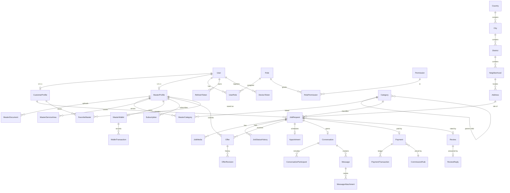

# Talpio — Veri Modeli

## 1. Genel Kurallar

| Kural            | Uygulama                                                                 |
| ---------------- | ------------------------------------------------------------------------ |
| Birincil anahtar | `id UUID` (v7 tercih edilir, sıralı olduğu için index dostu)             |
| Zaman damgaları  | `createdAt`, `updatedAt` her tabloda                                     |
| Soft delete      | Kullanıcı üretimi içerikte `deletedAt`; referans tablolarında `isActive` |
| Para             | `amountMinor BIGINT` (kuruş) + `currency CHAR(3)`; **float yasak**       |
| Enum             | PostgreSQL native enum, Prisma enum ile eşlenir                          |
| Metin arama      | `pg_trgm` + GIN index (kategori, satıcı adı, iş başlığı)                   |
| Coğrafi          | `latitude/longitude DECIMAL(9,6)`; ileride PostGIS'e geçilebilir         |
| Denetim          | Kritik tablolarda değişiklikler `AuditLog`'a yazılır                     |

## 2. Varlık İlişkileri — Çekirdek



## 3. Enum Tanımları

```ts
enum UserStatus {
  PENDING_VERIFICATION,
  ACTIVE,
  SUSPENDED,
  BANNED,
  DELETED,
}
enum RoleName {
  CUSTOMER,
  MASTER,
  SUPPORT,
  ADMIN,
  SUPER_ADMIN,
}
enum VerificationState {
  UNVERIFIED,
  PENDING,
  VERIFIED,
  REJECTED,
  EXPIRED,
}

enum JobRequestStatus {
  DRAFT, // Taslak
  PUBLISHED, // Yayında
  OFFERS_RECEIVED, // Teklifler alındı
  PROVIDER_SELECTED, // Satıcı seçildi
  SCHEDULED, // Randevu planlandı
  PROVIDER_EN_ROUTE, // Satıcı yolda
  IN_PROGRESS, // İş başladı
  AWAITING_CUSTOMER_APPROVAL, // Müşteri onayı bekliyor
  COMPLETED, // Tamamlandı
  CANCELLED, // İptal edildi
  DISPUTED, // Anlaşmazlık
  REFUNDING, // İade sürecinde
}

enum JobSize {
  SMALL,
  MEDIUM,
  LARGE,
  UNKNOWN,
}
enum TimeWindow {
  MORNING,
  AFTERNOON,
  EVENING,
  FLEXIBLE,
  URGENT,
}
enum OfferStatus {
  PENDING,
  ACCEPTED,
  REJECTED,
  WITHDRAWN,
  EXPIRED,
}
enum PriceType {
  FIXED,
  STARTING_FROM,
  AFTER_INSPECTION,
  HOURLY,
}
enum PaymentStatus {
  PENDING,
  AUTHORIZED,
  CAPTURED,
  IN_ESCROW,
  RELEASED,
  REFUNDED,
  FAILED,
  ON_HOLD,
}
enum TransactionType {
  CHARGE,
  CAPTURE,
  REFUND,
  COMMISSION,
  PAYOUT,
  ADJUSTMENT,
}
enum CommissionType {
  PERCENTAGE,
  FIXED_FEE,
  HYBRID,
}
enum MessageType {
  TEXT,
  IMAGE,
  LOCATION,
  SYSTEM,
  OFFER_CARD,
  APPOINTMENT_CARD,
}
enum NotificationChannel {
  IN_APP,
  PUSH,
  EMAIL,
  SMS,
}
enum DocumentType {
  IDENTITY,
  TAX_CERTIFICATE,
  CRAFTSMANSHIP,
  VOCATIONAL_QUALIFICATION,
  INSURANCE,
  OTHER,
}
enum TicketStatus {
  OPEN,
  IN_PROGRESS,
  WAITING_USER,
  RESOLVED,
  CLOSED,
}
enum DisputeStatus {
  OPEN,
  UNDER_REVIEW,
  RESOLVED_CUSTOMER,
  RESOLVED_MASTER,
  CANCELLED,
}
```

## 4. Önemli Tablolar (alan özeti)

### User

`id, email?, phone?, phoneCountryCode, passwordHash, status, emailVerifiedAt,
phoneVerifiedAt, locale, timezone, countryId, lastActiveAt, createdAt, updatedAt, deletedAt`

- `email` ve `phone` ayrı ayrı benzersiz (kısmi index, `deletedAt IS NULL` koşuluyla).
- En az biri zorunlu; kayıt akışı ikisini de toplar.

### MasterProfile

`id, userId, businessName, about, experienceYears, worksUrgent, canIssueInvoice,
verificationState, isPremium, ratingAverage, ratingCount, completedJobCount,
cancellationRate, avgResponseMinutes, workingHours(jsonb), lastActiveAt`

- `ratingAverage`, `completedJobCount` gibi alanlar **türetilmiş**; her değerlendirme/iş
  tamamlanmasında transaction içinde güncellenir (okuma performansı için denormalize).

### JobRequest

`id, customerId, categoryId, subcategoryId, title, description, problemStartedAt,
size, materialsIncluded, inspectionRequired, budgetMinor?, currency, isUrgent,
addressId, preferredDate, timeWindow, status, publishedAt, expiresAt,
selectedOfferId?, viewCount, offerCount`

Index: `(status, categoryId, cityId, createdAt DESC)`, `(customerId, status)`.

**Adres gizliliği:** `Address` tam alanlarıyla saklanır ama API katmanı, işi kabul edilmemiş
satıcılara yalnızca `district + neighborhood` döndürür. Tam adres `PROVIDER_SELECTED`
durumundan itibaren yalnızca seçilen satıcıya açılır.

### Offer

`id, jobRequestId, masterId, amountMinor, currency, priceType, estimatedDurationMinutes,
availableFrom, description, materialsIncluded, validUntil, status, revisionCount,
createdAt, respondedAt`

- Benzersiz kısıt: `(jobRequestId, masterId)` — bir satıcı bir işe tek aktif teklif verir;
  güncelleme `OfferRevision` olarak arşivlenir.
- Teklif kabulü **tek transaction**: seçilen teklif `ACCEPTED`, diğerleri `REJECTED`,
  iş `PROVIDER_SELECTED`, `Conversation` açılır, `Payment` kaydı oluşur.
- Yarış koşulu koruması: `JobRequest` satırı `SELECT ... FOR UPDATE` ile kilitlenir ve
  `selectedOfferId IS NULL` koşulu doğrulanır.

### Payment / PaymentTransaction

`Payment: id, jobRequestId, customerId, masterId, grossMinor, commissionMinor,
netMinor, currency, status, provider, providerRef, escrowReleasedAt`

`PaymentTransaction` değişmez (immutable) muhasebe kaydıdır; satır güncellenmez,
düzeltme yeni satır olarak eklenir.

### CommissionRule

`id, name, type, percentageBps, fixedMinor, currency, countryId?, cityId?, categoryId?,
appliesToPremium?, priority, validFrom, validTo, isActive`

- Yüzde değerleri **baz puan** (bps) olarak saklanır: %12,5 → `1250`.
- Eşleşen kurallar `priority` sırasına göre değerlendirilir, ilk eşleşen uygulanır.

### Review

`id, jobRequestId (unique), customerId, masterId, scoreQuality, scoreTimeliness,
scoreCommunication, scoreValue, scoreTidiness, overallScore, comment, isVisible,
createdAt`

- Yalnızca `COMPLETED` durumundaki ve ödemesi kayıtlı iş için oluşturulabilir (DB
  kısıtı + servis doğrulaması).
- `overallScore` beş alt puanın ortalaması, kayıt anında hesaplanır.

### Message

`id, conversationId, senderId, type, body?, metadata(jsonb), flagged, flagReason?,
readAt?, createdAt`

- Silme yok; `MessageVisibility(userId, messageId, hiddenAt)` ile kullanıcı bazlı gizleme.
- `flagged`, telefon/IBAN örüntü kontrolünden geçmeyen mesajlar için işaretlenir.

## 5. Denormalizasyon ve Sayaçlar

Aşağıdaki sayaçlar okuma performansı için tabloda tutulur ve **her zaman transaction
içinde** güncellenir:

| Alan                                         | Tetikleyici                            |
| -------------------------------------------- | -------------------------------------- |
| `JobRequest.offerCount`                      | Teklif ekleme / geri çekme             |
| `MasterProfile.ratingAverage`, `ratingCount` | Yeni değerlendirme                     |
| `MasterProfile.completedJobCount`            | İş `COMPLETED` olduğunda               |
| `MasterProfile.cancellationRate`             | İptal kaydı                            |
| `MasterProfile.avgResponseMinutes`           | Teklif verildiğinde hareketli ortalama |

## 6. Index Planı (N+1 ve tarama önleme)

```sql
CREATE INDEX ON "JobRequest" (status, "categoryId", "cityId", "createdAt" DESC);
CREATE INDEX ON "JobRequest" ("customerId", status);
CREATE INDEX ON "Offer" ("jobRequestId", status);
CREATE INDEX ON "Offer" ("masterId", status, "createdAt" DESC);
CREATE INDEX ON "Message" ("conversationId", "createdAt" DESC);
CREATE INDEX ON "MasterServiceArea" ("districtId", "masterId");
CREATE INDEX ON "MasterCategory" ("categoryId", "masterId");
CREATE INDEX ON "Notification" ("userId", "readAt", "createdAt" DESC);
CREATE INDEX ON "AuditLog" ("entityType", "entityId", "createdAt" DESC);
CREATE UNIQUE INDEX ON "User" (email) WHERE "deletedAt" IS NULL;
CREATE UNIQUE INDEX ON "User" (phone) WHERE "deletedAt" IS NULL;
```

Liste sorgularında Prisma `include` yerine seçilmiş `select` kullanılır; satıcı kartı için
gereken alanlar tek sorguda çekilir.

## 7. Satıcı Eşleştirme Sorgusu

Bir talep yayınlandığında uygun satıcılar şu koşullarla bulunur:

1. `MasterCategory` kaydı talebin kategorisi veya üst kategorisiyle eşleşiyor.
2. `MasterServiceArea` talebin ilçesini (veya tüm şehri) kapsıyor.
3. `MasterProfile.verificationState = VERIFIED` ve `User.status = ACTIVE`.
4. Acil talepse `worksUrgent = true`.
5. Satıcı askıya alınmamış ve abonelik limiti dolmamış.

Sonuç `job-matching` kuyruğuna verilir; bildirimler toplu (batch) gönderilir.

## 8. Para Birimi ve Yuvarlama

- Tüm hesaplar tam sayı kuruş üzerinden yapılır.
- Komisyon: `commissionMinor = floor(grossMinor * percentageBps / 10000) + fixedMinor`.
- Yuvarlama farkı her zaman platform lehine değil, **belirlenmiş tek yönde** (aşağı)
  uygulanır ve `PaymentTransaction`'da ayrı satır olarak izlenir.
- Gösterim `Intl` ile kullanıcı diline göre biçimlendirilir.
