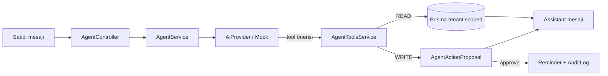
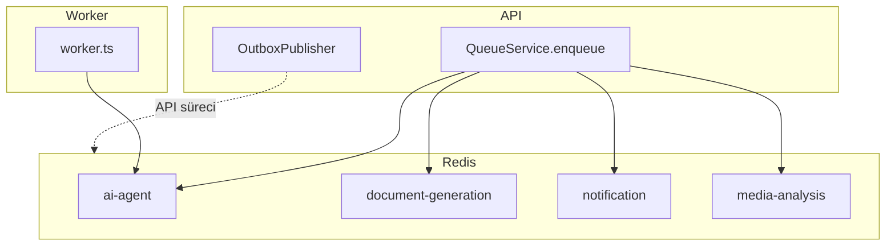

# Faz 0 + Agent MVP — Teslimat

## Mimari kararlar

1. **Outbox publisher API sürecinde kalır.** `OUTBOX_POLL_MS` ile PENDING satırları yayınlar. Uzun AI tool döngüleri ayrı worker’da (`ai-agent` kuyruğu) işlenir. MVP chat senkron HTTP yanıtı verir; worker asenkron yük için hazırdır.
2. **AiProvider soyutlaması** ödeme sağlayıcısı desenini izler (`AI_PROVIDER` DI token). Production’da `AI_DRIVER=mock` reddedilir.
3. **Agent yalnızca allowlist tool** çağırır. WRITE tool’lar `AgentActionProposal` üretir; onaydan sonra Reminder yazılır.
4. **Finans LLM’de hesaplanmaz.** Ciro / tahsilat Prisma aggregate ile deterministic üretilir.
5. **tenantId = providerProfileId.** Her sorgu bu alanla filtrelenir.
6. **Sahte veri yok.** Boş sonuç mesajı: `Kayıt bulunamadı.`

## Dosya listesi

### Infra
- `apps/backend/src/infra/ai/*` — AiProvider, Mock/OpenAI/Anthropic, AiService, module
- `apps/backend/src/infra/queue/*` — QueueService, worker factory, constants
- `apps/backend/src/infra/outbox/*` — OutboxService, OutboxPublisher, module

### Agent
- `apps/backend/src/modules/agent/*` — controller, service, tools, registry, mapper, dto, specs
- `apps/backend/src/worker.ts` + `worker.module.ts`

### Paylaşılan / web
- `packages/config` — `/agent/*` rotaları + query keys
- `packages/api-client` — `resources/agent.ts`
- `packages/localization` — `agent.*` TR/EN
- `packages/types` — `getTomorrowSchedule` tool adı eklendi
- `apps/web/src/features/agent/*` + provider dashboard gömülü panel

### Diğer
- Prisma migration `phase0_ai_agent_outbox`
- `scripts/smoke-agent.mjs`
- Env: `AI_*`, `OUTBOX_POLL_MS`, `WORKER_CONCURRENCY`

## Diyagramlar

### Outbox → köprü

```mermaid
sequenceDiagram
  participant API as OffersService.accept
  participant DB as Postgres
  participant Pub as OutboxPublisher
  participant Link as MarketplaceWorkOrderLink

  API->>DB: order.create + outbox.write(order.created)
  Pub->>DB: poll PENDING
  Pub->>Link: upsert PENDING by orderId
  Pub->>DB: outbox.write(work_order.bridge_requested)
  Pub->>DB: status=PUBLISHED
```

### Agent chat



### Kuyruk / worker



## Tool registry

| Tool | Tür | Not |
| --- | --- | --- |
| getTodaySchedule | READ | scheduledAt / startedAt bugün |
| getTomorrowSchedule | READ | yarın |
| getPendingOffers | READ | OfferStatus.SUBMITTED |
| getPendingPayments | READ | OrderStatus.PENDING_PAYMENT |
| getActiveOrders | READ | PAID / IN_PROGRESS / AWAITING_APPROVAL |
| getRecentNotifications | READ | son 10 |
| getMonthlyRevenueSummary | READ | CAPTURED payments (ay) |
| searchCustomerOrOrder | READ | ad / başlık fragment |
| createReminderDraft | WRITE | onay zorunlu |

## Güvenlik modeli

- Rol: yalnızca `PROVIDER`
- Scope: `providerProfile.id` zorunlu filtre
- Tool allowlist dışı ad → `FORBIDDEN`
- Yazma: insan onayı + `AuditLogService.record`
- Production: `AI_DRIVER=mock` yasak

## Çalıştırma

```bash
# API
npm run dev:api

# Worker (ai-agent kuyruğu)
npm run dev:worker

# Birim testleri (backend)
cd apps/backend && npm test -- --testPathPattern="env.schema|mock-ai|outbox.service|agent-"

# Duman
npm run smoke:agent
```

## Ortam değişkenleri

| Değişken | Varsayılan | Not |
| --- | --- | --- |
| AI_DRIVER | mock | production’da mock yasak |
| AI_OPENAI_API_KEY | — | openai sürücüsü |
| AI_ANTHROPIC_API_KEY | — | anthropic sürücüsü |
| AI_TIMEOUT_MS | 30000 | |
| AI_MAX_RETRIES | 2 | exponential |
| AI_DEFAULT_MODEL | gpt-4o-mini | |
| OUTBOX_POLL_MS | 2000 | API süreci |
| WORKER_CONCURRENCY | 2 | BullMQ worker |

## Domain sınırları ve migration planı (Faz 2 hazırlığı)

Tam ERP bu fazda yazılmaz. Sınır tipleri: `packages/types/src/models/erp-prep.ts`.

| Entity | Amaç | Tenant | Not |
| --- | --- | --- | --- |
| CrmCustomer | Satıcı işletme müşterisi | `providerProfileId` | Marketplace User’dan ayrı |
| WorkOrder | İş kaydı + pipeline | `providerProfileId` | Order ile aynı tablo değil |
| WorkOrderSource | Kaynak enum | — | TALPIO, PHONE, … |
| WorkOrderStage | Pipeline aşaması | — | NEW → COLLECTED / … |
| WorkOrderActivity | Not / durum / iletişim | WorkOrder | Audit benzeri olaylar |
| WorkOrderAssignment | Atanan satıcı/ekip | WorkOrder | Multi-staff hazırlığı |

**Köprü (Faz 0’da var):** `MarketplaceWorkOrderLink` — `orderId` unique, `workOrderId` nullable, status PENDING → LINKED. `order.created` outbox → publisher upsert (idempotent).

**Migration sırası (Faz 2):**
1. `CrmCustomer` (+ soft delete, tenant index)
2. `WorkOrder` + Source/Stage enum’ları
3. `WorkOrderActivity`, `WorkOrderAssignment`
4. `MarketplaceWorkOrderLink.workOrderId` FK bağla; bridge consumer WorkOrder oluşturur
5. Marketplace `JobRequest` / `Offer` / `Order` / `Payment` tablolarına dokunma

## Gözlemlenebilirlik (Faz 0 ölçüm noktaları)

| Metrik | Kaynak |
| --- | --- |
| Queue counts | `QueueService.getJobCounts()` |
| AI istek / hata / token | `AiUsageEvent` |
| Tool süre / başarı | `AgentToolInvocation` |
| Onay / red | `AgentActionProposal` + `AuditLog` |

Admin dashboard paneli sonraki faz; veri modeli ve yazım yolları hazır.

## Bilinen borç

- OpenAI / Anthropic HTTP istemi iskelet; henüz gerçek çağrı yok
- Agent chat senkron; uzun tool döngülerini kuyruğa almak opsiyonel
- WorkOrder / CRM şeması Faz 2 (yalnızca MarketplaceWorkOrderLink)
- Prompt injection’a karşı ek sanitization yok; allowlist ana savunma
- Web panel ince; mobil agent UI yok
- Metriklerin admin UI / Prometheus export’u yok

## Test sonuçları

```
# Birim (apps/backend)
Test Suites: 5 passed (env.schema, mock-ai, outbox.service, agent-*, offers.service)
Tests:       48 passed

# Duman
npm run smoke:agent
  PASS  satıcı girişi 200
  PASS  thread 201/200
  PASS  mesaj 200/201
  PASS  başarı zarfı
  PASS  assistant yanıtı var
  PASS  tool/veri yolu
```
