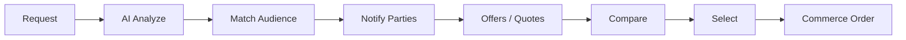

# TeklifPilot Vision 2.0 — Mimari Master Plan

> Ürün master prompt’unun resmi plan çıktısı.  
> **Kod yazılmaz** — önce bu doküman onaylanır, sonra faz faz uygulanır.  
> Kural: Mevcut çalışan marketplace bozulmaz; yeni domainler yanına eklenir.

---

## 1. Vizyon özeti

**TeklifPilot**, AI destekli *Demand Driven Commerce Platform* (talep odaklı ticaret işletim sistemi) olacaktır.

| Merkez değil | Merkez |
| --- | --- |
| Ürün kataloğu | **Request (Talep)** |
| Mağaza vitrini | Talep dağıtımı + teklif toplama |
| Tek dikey (satıcı) | Kategori-agnostik, rol-genişletilebilir platform |

Birleşen yüzeyler: Marketplace · ERP · CRM · AI Agent · Muhasebe · Teklif · Talep · Satış · Tedarik · İş takibi · Müşteri / Üretici / Distribütör yönetimi.

---

## 2. Mevcut durum (bugün: Talpio)

### 2.1 Ne var

| Alan | Durum |
| --- | --- |
| Marka / paketler | Hâlâ **Talpio** (`@talpio/*`) |
| Roller | `CUSTOMER`, `PROVIDER`, `SUPPORT`, `ADMIN`, `SUPER_ADMIN` (tek enum kolon) |
| Yetki | Statik `ROLE_PERMISSIONS` matrisi; Nest’te çoğunlukla `@Roles` — DB-driven RBAC yok |
| Marketplace merkezi | **JobRequest → Offer → Order → Payment → Review** |
| Kategori | `ServiceCategory` DB’de dinamik; JobRequest’te **zorunlu** |
| ERP/CRM | Sadece prep tipler + `MarketplaceWorkOrderLink`; WorkOrder/CrmCustomer şemada yok |
| AI | AiProvider + Mock çalışıyor; OpenAI/Anthropic iskelet; provider agent MVP (9 tool) |
| Kuyruk / outbox | BullMQ + transactional outbox + worker process |
| Tenant | Soft: `tenantId = providerProfileId`; org/tenant tablosu yok |
| Para / vergi | Minor unit + `currency` (default TRY); vergi/FX/çok ülke motoru yok |
| Uygulamalar | API, web (müşteri+satıcı), admin, Expo mobile |

### 2.2 Faz 0 (korunacak temel)

- AiProvider soyutlaması, queue, outbox, agent allowlist + onay + audit  
- Detay: `docs/08-phase-0-delivery.md`

### 2.3 Eski vizyon dokümanları

`docs/06` hâlâ “satıcı işletme OS” dilinde. Bu doküman (**09**) Vision 2.0 için **üst plan**dır; 06–08 tarihsel / altyapı referansı olarak kalır.

---

## 3. Gap analizi (vizyon ↔ bugün)

### 3.1 Kritik eksikler

| Vizyon | Bugün | Gap |
| --- | --- | --- |
| Marka TeklifPilot | Talpio | Rename + i18n + iletişim kimliği |
| Request evrensel merkez | JobRequest (hizmet) | Genel `Request` modeli + tip/uzantı |
| Roller: Buyer, Supplier, Manufacturer, Distributor, … | 5 sabit rol | Extensible Party/Role + RBAC |
| Rol bağımsızlığı / yeni rol ekleme | Enum + kod değişikliği | Permission + Assignment tabloları |
| B2B zinciri Manufacturer→Distributor→Dealer | Yok | Org ilişkileri, kanal, kampanya |
| Üretici / Distribütör panelleri | Yok | Yeni app yüzeyleri veya web zone’lar |
| Satıcı ERP (çok kaynaklı iş) | Prep only | WorkOrder + CrmCustomer + köprü |
| AI Sales Coach / Procurement / Accountant / Marketing | Yok | Agent ürün ailesi + tool setleri |
| Medya AI (foto/video/ses/PDF/CAD) | Queue isimleri var | Worker + model pipeline |
| Multi currency / tax / country / timezone | Kısmi geo + TRY | Tax/FX/tenant locale paketi |
| CQRS ready | Klasik servisler | Command/Query ayrımı kademeli |
| Telemetry / monitoring ürünleşmiş | Tablolar + counts | Admin/ops metrik yüzeyi |

### 3.2 Korunacaklar (bozulmayacak)

- JobRequest / Offer / Order / Payment / Message / Notification / Review akışları  
- Mevcut web/admin/mobile ekranları (geçiş döneminde alias / adapter)  
- Phase 0 AI / queue / outbox altyapısı  

---

## 4. Hedef domain haritası (bounded contexts)

```text
┌─────────────────────────────────────────────────────────────┐
│                     Identity & Access                         │
│  Party · Membership · Role · Permission · Audit · Tenant      │
└─────────────────────────────────────────────────────────────┘
                              │
┌──────────────┐  ┌──────────────┐  ┌──────────────────────────┐
│   Request    │  │  Marketplace │  │     Matching / Notify     │
│  (çekirdek)  │──│ Offer/Quote  │──│  Audience · Campaign      │
└──────────────┘  └──────────────┘  └──────────────────────────┘
                              │
┌──────────────┐  ┌──────────────┐  ┌──────────────────────────┐
│  Commerce    │  │  Seller ERP  │  │     Channel B2B           │
│ Order/Pay/…  │  │ CRM/WorkOrder│  │ Mfr·Dist·Dealer·Supplier  │
└──────────────┘  └──────────────┘  └──────────────────────────┘
                              │
┌─────────────────────────────────────────────────────────────┐
│  AI Platform: Provider · Agents · Prompts · Tools · Approval │
│  Coach · Procurement · Accountant · Marketing                 │
└─────────────────────────────────────────────────────────────┘
                              │
┌─────────────────────────────────────────────────────────────┐
│  Platform: Queue · Outbox · Files · Localization · Tax/FX     │
└─────────────────────────────────────────────────────────────┘
```

**Hiçbir rol birbirine bağımlı tasarlanmaz:** ilişki `PartyRelation` / `ChannelMembership` ile kurulur; kodda `if (role === PROVIDER)` zinciri azaltılır.

---

## 5. Kimlik, rol ve RBAC tasarımı

### 5.1 Kavramlar

| Kavram | Anlam |
| --- | --- |
| **Tenant** | İşletme / organizasyon sınırı (multi-tenant kök) |
| **Party** | Aktör (kişi veya org profili) |
| **Membership** | User ↔ Tenant (+ varsayılan Party) |
| **Role** | Mantıksal rol kodu (`buyer`, `supplier`, `manufacturer`, …) — **DB’de genişletilebilir** |
| **Permission** | İnce yetki (`request:create`, `offer:submit`, `campaign:publish`, …) |
| **RolePermission** | Rol → izin matrisi (admin düzenleyebilir) |
| **Grant** | İstisna / özel grant (opsiyonel) |

### 5.2 Hedef roller (seed, sabit kod değil)

Buyer · Supplier · Service Provider · Manufacturer · Distributor · Wholesaler · Dealer · Enterprise · Courier · Admin · Support · (AI Agent = sistem aktörü, insan rolü değil)

### 5.3 Geçiş stratejisi (kırılmadan)

1. Mevcut `UserRole` enum **deprecated alias** olarak kalır.  
2. Mapping: `CUSTOMER→buyer`, `PROVIDER→service_provider` (+ ileride `supplier`), staff → admin/support.  
3. Yeni endpoint’ler `PermissionsGuard` kullanır; eski `@Roles` bir süre dual-check.  
4. Enum kaldırma en son fazda.

---

## 6. Request — tek ortak domain

### 6.1 Çekirdek model (kategori-agnostik)

```text
Request
  id, tenantId? (oluşturan org), createdByUserId
  title, description
  categoryId?, subcategoryId?     # opsiyonel veya AI önerisi sonrası
  location (geo), deadline, budgetMin/Max, currency
  tags[], status
  aiSummary, aiCategoryId, aiConfidence
  media[] (photo|video|audio|pdf|cad|drawing)
  metadata JSONB                  # dikey alanlar buraya; şemaya gömülmez
```

### 6.2 JobRequest ile ilişki

| Seçenek | Karar |
| --- | --- |
| **A — Adapter (önerilen Faz 1)** | `Request` yeni tablo; `JobRequest` bir *projection* / `request_id` FK ile bağlanır. Eski API’ler JobRequest üzerinden çalışmaya devam eder. |
| B — Rename in place | Yüksek risk; şimdilik **yapılmaz**. |

**Kural:** Hiçbir kategori özel Nest modülü veya kolon seti almaz. Dikey ihtiyaç = `metadata` + kategori şablonları (ileride).

### 6.3 Yaşam döngüsü (özet)

`DRAFT → PUBLISHED → MATCHING → QUOTING → SELECTED → FULFILLING → COMPLETED → (DISPUTE|CANCELLED)`

Mevcut JobRequest status’leri adapter ile map edilir.

---

## 7. Marketplace (talep dağıtımı)

Marketplace **ürün satmaz**; talep dağıtır.



Teklif (Offer/Quote) alanları (hedef): fiyat, teslim süresi, alternatifler, garanti, teknik açıklama, dosyalar, opsiyonlar, kampanya referansı.

Mevcut `Offer` modeli genişletilir (nullable yeni alanlar) veya `Quote` alt tipi ile versionlanır — **breaking change yok**.

---

## 8. Satıcı ERP / CRM

Marketplace müşteri kazandırır; ERP işletmeyi yönetir.

| Entity | Amaç |
| --- | --- |
| CrmCustomer | Tenant kapsamlı müşteri |
| WorkOrder | Tüm kaynaklardan iş |
| WorkOrderSource | TALPIO, PHONE, WHATSAPP, … |
| WorkOrderStage | Pipeline |
| WorkOrderActivity | Aktivite / not |
| WorkOrderAssignment | Atama |
| MarketplaceWorkOrderLink | Order ↔ WorkOrder (zaten var; FK tamamlanacak) |

Idempotent köprü: `order.created` outbox → link upsert → WorkOrder create (bir kez).

---

## 9. Channel B2B (üretici / distribütör)

```text
Manufacturer ──distributes──▶ Distributor ──supplies──▶ Dealer/Supplier
                     │
                     └── Campaign / PriceList / Stock / Loyalty
```

Yeni domainler (Faz 3+):

- `Organization` / `Tenant` profil tipleri  
- `ChannelRelation` (fromParty, toParty, type, region)  
- `Campaign`, `PriceList`, `PriceListItem`, `RegionalPrice`  
- `StockItem` (basit; tam WMS değil)  
- `DealerPerformance` metrik görünümleri  

Gelir modeli 2: üretici/distribütör → satıcılara kampanya / fiyat listesi.

---

## 10. AI platform ürün ailesi

| Ürün | Görevi | Bağımlılık |
| --- | --- | --- |
| **Request AI** | Analiz, kategori, eksik bilgi, medya yorumu, eşleştirme | media-analysis queue |
| **Business Agent** | “Bugün ne yapacağım?” (mevcut MVP genişler) | tools + approval |
| **Sales Coach** | Teklif başarı, fiyat, rakip, yeniden satış | analytics + offers |
| **Procurement** | Daha ucuz kaynak, stok, kampanya | channel B2B |
| **Accountant** | Gelir/gider/nakit/vergi özeti | ledger (sonra) |
| **Marketing** | WhatsApp/SMS/Mail kampanya önerisi | notifications |

**Değişmeyen güvenlik kuralları (Faz 0’dan):**

- Ham SQL yok; allowlist tools; tenant filtre; WRITE = onay; finans LLM’de hesaplanmaz; boş = “kayıt bulunamadı”.

---

## 11. Veritabanı değişiklikleri (yüksek seviye)

### Faz V2-0 — Kimlik omurgası (breaking yok)

- `tenants`, `party_profiles`, `memberships`  
- `roles`, `permissions`, `role_permissions` (seed + mevcut enum map)  
- `user_role` kolonunu tut; `membership_roles` ekle  

### Faz V2-1 — Request omurgası

- `requests`, `request_media`, `request_tags`  
- `job_requests.request_id` nullable FK (backfill job)  
- AI alanları: summary, category, confidence  

### Faz V2-2 — ERP

- `crm_customers`, `work_orders`, activities, assignments  
- `marketplace_work_order_links.work_order_id` FK  

### Faz V2-3 — Channel B2B

- relations, campaigns, price lists, stock skeleton  

### Faz V2-4 — Commerce genelleştirme

- Order’a `request_id` / party referansları (eski alanlar kalır)  
- Tax/FX tabloları: `tax_profiles`, `fx_rates` (minimal)  

### Yapılmayacaklar (bilinçli)

- JobRequest’i silmek veya Order ile WorkOrder’u tek tabloya zorlamak  
- Kategori bazlı özel tablolar  

---

## 12. API tasarımı (yön)

Base: `/api/v1` (mevcut). Yeni kaynaklar feature-based:

| Grup | Örnek endpoint’ler |
| --- | --- |
| Identity | `GET/POST /tenants`, `/memberships`, `/roles`, `/permissions` |
| Request | `POST /requests`, `GET /requests/:id`, `POST /requests/:id/publish`, `POST /requests/:id/analyze` |
| Matching | `GET /requests/:id/audience`, `POST /requests/:id/notify` |
| Quotes | Mevcut `/offers` + genişleyen alanlar; ileride `/quotes` alias |
| ERP | `/crm/customers`, `/work-orders`, … |
| Channel | `/channel/relations`, `/campaigns`, `/price-lists` |
| AI Agents | `/agent/*` (mevcut) + `/agent/coach/*`, `/agent/procurement/*` (sonra) |
| Legacy | `/jobs/*` → Request adapter (deprecation header ileride) |

Versiyonlama: yeni alanlar optional; breaking değişiklikler `/api/v2` veya uzun deprecation.

---

## 13. UI/UX planı

| Yüzey | Değişiklik |
| --- | --- |
| **Marka** | TeklifPilot kimliği (logo, i18n `appName`, meta); geçişte “powered by” gerekmez |
| **Buyer** | Evrensel “Talep oluştur” (medya + AI adımları); karşılaştırma masası güçlenir |
| **Service Provider / Supplier** | Mevcut satıcı paneli + ERP menüleri (CRM, işler, ajan) |
| **Manufacturer** | Yeni zone: bayiler, kampanya, fiyat listesi, stok |
| **Distributor** | Bölge satıcıları, kampanya, sadakat, performans |
| **Admin** | Rol/izin matrisi düzenleme; kategori evrensel; metrikler |
| **Mobile** | Önce Buyer + Service Provider; B2B paneller web-first |

**İlk viewport kuralı:** mevcut tasarım sistemi korunur; yeni paneller feature klasörlerinde (`features/requests`, `features/channel`, …).

---

## 14. Güvenlik riskleri ve kontroller

| Risk | Kontrol |
| --- | --- |
| Tenant sızıntısı (çapraz işletme veri) | Her sorguda `tenantId`; integration test zorunlu |
| Rol şişmesi / yanlış izin | Default-deny; WRITE permission ayrı; admin grant audit |
| Agent yetki aşımı | Allowlist + dual auth (tool + domain service) + onay |
| Prompt injection | Tool-only action; serbest SQL/kod yok; prompt versioning |
| B2B fiyat listesi sızıntısı | ChannelRelation scope; bölgesel ACL |
| Privilege escalation via legacy Roles | Dual-guard dönemi; eski endpoint envanteri |
| AI maliyet / abuse | Rate limit, usage events, per-tenant quota |
| PII medya (CAD, ses) | Signed URL, retention policy, audit |

---

## 15. Performans ve ölçeklenebilirlik

| Konu | Plan |
| --- | --- |
| Matching fan-out | Async: Request publish → outbox → BullMQ `notification` / `ai-agent` |
| Medya AI | `media-analysis` queue; API’de senkron yok |
| Read modelleri | CQRS-ready: listeler için ileride read table / materialized view |
| Outbox | Zaten var; partition / archive politikası ekle |
| DB index | `(tenant_id, status, created_at)` tüm iş tablolarında |
| Search | İlk faz DB ILIKE; sonra OpenSearch/Meilisearch kararı |
| Multi-region | Sonra; şimdiden `timezone`, `currency`, `country_code` alanları |

---

## 16. Uygulama yol haritası (önerilen fazlar)

> Her faz: tasarım notu → şema → API → UI ince dilim → test → teslim dokümanı.

| Faz | İsim | Çıktı | Mevcut sistem |
| --- | --- | --- | --- |
| **V2-P0** | Doktrin & rename planı | Bu master plan onayı; marka rename checklist; legacy map | Dokunulmaz |
| **V2-P1** | Identity & RBAC omurgası | Tenant/Membership/Role/Permission tabloları; PermissionsGuard; legacy map | Auth bozulmaz |
| **V2-P2** | Universal Request + adapter | `Request` modeli; JobRequest bağlama; AI analyze iskeleti | `/jobs` çalışır |
| **V2-P3** | ERP dilimi | CrmCustomer + WorkOrder + köprü consumer | Order akışı aynı |
| **V2-P4** | Agent genişleme | Request/ERP tool’ları; Sales Coach v0 | Mevcut agent kalır |
| **V2-P5** | Channel B2B v0 | Manufacturer/Distributor rolleri + kampanya MVP | Marketplace etkilenmez |
| **V2-P6** | AI medya + Procurement | Foto/PDF analiz; tedarik önerisi | Queue’lar dolar |
| **V2-P7** | Accountant + Tax/FX | Basit ledger + vergi profili | TRY default devam |
| **V2-P8** | Global paket | Multi-lang/currency/tax/timezone sertleştirme | — |

**İnce dikey dilim prensibi:** Her fazda kullanıcıya görünen en az bir ekran/akış (Faz 0’daki gibi).

---

## 17. İlk onay soruları (kod öncesi)

1. Marka rename (**TeklifPilot**) paket scope’unda (`@teklifpilot/*`) hemen mi, yoksa ürün adı önce i18n’de mi?  
2. Request adapter (JobRequest yanına) onayı?  
3. İlk kod fazı **V2-P1 RBAC** mı, **V2-P2 Request** mi?  
4. B2B (Manufacturer) MVP hangi dikey örnekle (ör. yağ / PVC / elektrik)?  
5. Mobil B2B ertelensin mi (öneri: evet)?  

---

## 18. Teslim beklentisi (her faz)

- Mimari karar notu  
- Dosya/şema listesi  
- Veri akış diyagramı  
- Güvenlik / tenant notu  
- Test sonuçları  
- Lokal komutlar + env örneği  
- Bilinen borçlar  

---

## 19. Bilinçli teknik borç (vizyon kabulü)

- Talpio adı geçiş süresince kodda kalabilir  
- JobRequest dual-write dönemi  
- OpenAI/Anthropic henüz iskelet  
- CQRS tam bus yok — “ready” seviyesinde kalınır  
- Tam muhasebe / WMS / lojistik courier ağı sonraki fazlar  

---

**Sonraki adım:** Bu planın onaylanması + §17 sorularının cevaplanması. Onaysız kod yazılmaz.
